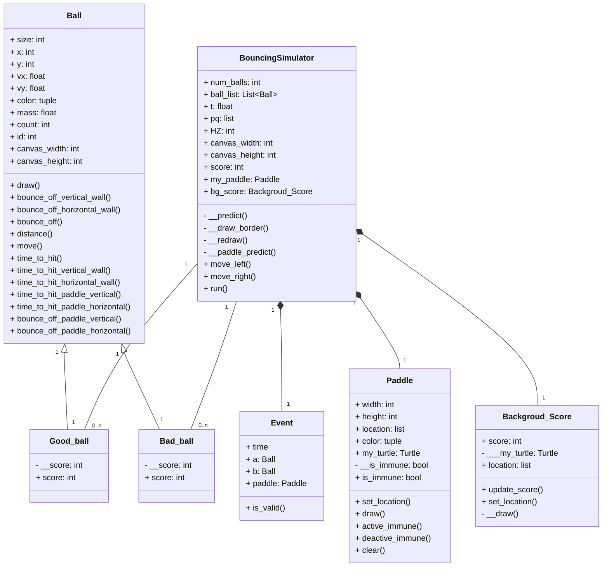

# Ball bouncing game 10-?

This project is all about ball and paddle that user need use control paddle left and right to hit the `Green Ball` that gonna `give 1` score and in the same time user need to aviod `Red Ball` that gonna `minus 1` score if score reach 10 score that game will end.


## Installation

clone repository
```bash
git clone https://github.com/Xeei/ball_bouncing_sim_oo.git
```

start game
```bash
python run_ball.py
```

    
## Usage/Examples

Interaction
| Key | effect | type |
| :--: | - | :- |
| ⬅️ | paddle move left | press |
| ➡️ | paddle move right | press |
| ␣ | active paddle immune | hold |

## Project design and implementation

### UML Diagram


### Modify
- Make paddle can bouce with ball in horizontal way
- Create immune mode by hold space bar
### Extend
- Make Background score to render score that user get while playing
### Test
- test by simulation and see that the ball can hit the ball accuracy
- Test that score system are collect score correctly
### Bug
- There are some bug that when paddle move that ball bounce off before hit paddle sometime but it really small
## Rating
i give myself `80/100` because i only fix paddle to can hit in horizontal way and make it can immute and make score background.
